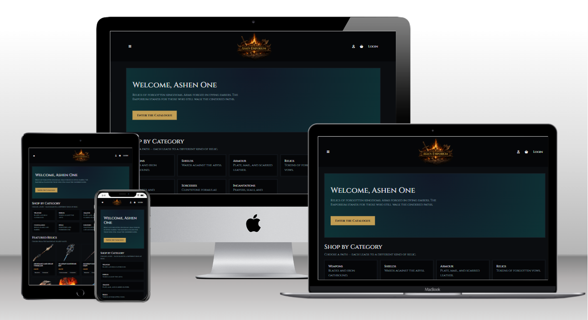
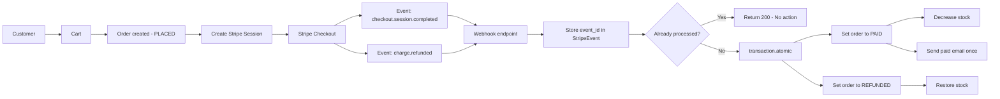
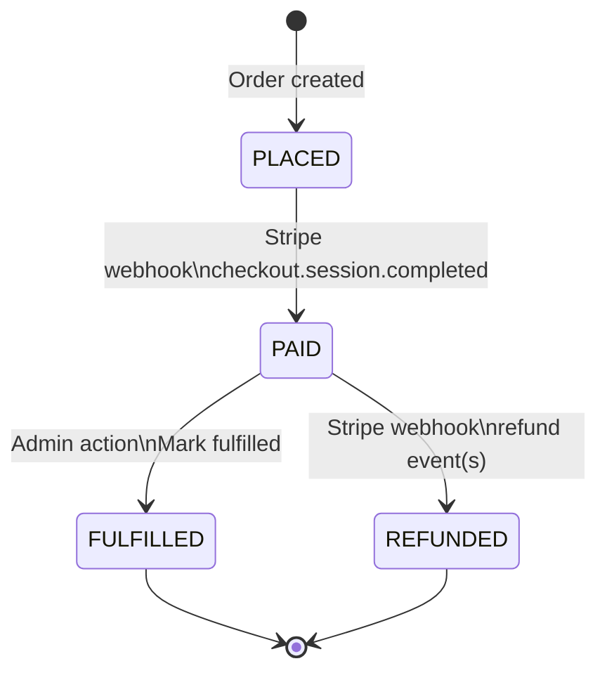

<div align="center">

# 🗡️ Ashen Emporium

[](https://ashen-emporium-ecommerce-533460192970.herokuapp.com/)


</div>

---



**A Souls-inspired e-commerce platform built with Django**

Ashen Emporium is a full-stack Django application that combines automated content ingestion, rich lore presentation, and real-world e-commerce functionality into a cohesive, extensible retail platform inspired by Souls-like RPGs.

This project emphasises **scalable architecture, automation over manual admin work, and production-ready patterns**, making it suitable as both a portfolio piece and a foundation for future expansion.

---

## 📑 Table of Contents

- [Live Demo](#-live-demo)
- [Project Overview](#-project-overview)
- [Architecture & System Design](#-architecture--system-design)
- [Order & Payment Lifecycle](#-order--payment-lifecycle)
- [Webhook & Idempotency Design](#-webhook--idempotency-design)
- [Core Features](#-core-features)
  - [E-commerce](#-e-commerce)
  - [Armour Sets (Advanced Domain Logic)](#-armour-sets-advanced-domain-logic)
  - [Lore System](#-lore-system)
  - [Automation & Data Pipelines](#-automation--data-pipelines)
  - [Frontend & UX](#-frontend--ux)
- [Testing Strategy](#-testing-strategy)
- [Security & Production Considerations](#-security--production-considerations)
- [Technology Stack](#-technology-stack)
- [Project Structure](#-project-structure)
- [Local Setup](#-local-setup)
- [Deployment Notes](#-deployment-notes)
- [Licensing & Assets](#-licensing--assets)
- [Author](#-author)
- [Future Enhancements](#-future-enhancements)

---

## 🔥 Live Demo

> Deployment prepared (Heroku-ready).  
> Production upload of media assets intentionally deferred (see Licensing section).

---

## 📜 Project Overview

The goal of Ashen Emporium is to model how a large, content-heavy catalogue (weapons, armour, spells, sets) can be:

- ingested automatically from external asset libraries  
- enriched with lore and metadata  
- presented through a modern, mobile-friendly UI  
- sold using realistic checkout and stock-control logic  

The project deliberately mirrors challenges found in real retail systems:
- bundles and sets
- partial availability
- shared components
- automated classification
- safe bulk operations

---

## 🏗 Architecture & System Design

**Design goals:** webhook-as-source-of-truth, atomic stock reconciliation, and idempotent event processing to prevent double-decrement/refund replays.





> Note: Mermaid diagrams render on GitHub. Some local Markdown previews may show “diagram not supported”.

Ashen Emporium is structured around a separation of concerns between:

Catalogue domain logic (products, armour sets, lore)

Commerce logic (cart, orders, stock control)

Payment orchestration (Stripe Checkout + webhook lifecycle)

Automation pipelines (management commands for ingestion and classification)

Key architectural principles:

Webhook as single source of truth for payment state

Idempotent event handling

Atomic database transactions for stock integrity

Clear order state transitions

Automation over manual administration

The system is intentionally designed to reflect real-world retail backend constraints, not tutorial-level examples.

---

## 💳 Order & Payment Lifecycle

The order system models explicit state transitions:

PLACED → PAID → FULFILLED
            ↘ REFUNDED

PLACED

Created at checkout initiation

Stripe session created

No stock mutation yet

PAID

Triggered only via verified Stripe webhook

Stock decremented atomically

Payment identifiers stored

Confirmation email sent post-commit

REFUNDED

Triggered via Stripe refund webhook events

Stock restored atomically

Refunded timestamp recorded

Idempotent protection prevents double-restoration

FULFILLED

Admin-triggered state change

Restricted to paid orders only

This lifecycle ensures consistency between:

Stripe payment state

Order status

Inventory levels

---

## 🔁 Webhook & Idempotency Design

The webhook implementation includes:

Stripe signature verification

Event type filtering

Atomic transaction boundaries

Event ledger (StripeEvent model)

Unique constraint on event_id

Safe replay handling (no duplicate stock changes)

select_for_update() row locking

This prevents:

Double stock decrement

Double refund restoration

Duplicate confirmation emails

Race conditions during concurrent requests

Replay simulation is tested using:

stripe events resend evt_...

The system safely no-ops on duplicate events.

---

## ✨ Core Features

### 🛒 E-commerce

- Product catalogue with search, filtering, and pagination
- Session-based shopping cart with quantity management
- Stripe Checkout integration (test mode)
- Stock-aware purchasing and validation
- Cart badge counts via context processors

---

### 🛡️ Armour Sets (Advanced Domain Logic)

Armour pieces are automatically grouped into **Armour Sets** (e.g. *Alberich’s Set*) using filename and name analysis.

Each set provides:
- a dedicated set detail page
- hero image selection
- image gallery switching
- per-piece availability status
- bundle pricing with automatic discount
- ability to:
  - add the full set
  - or add **only missing pieces** already not owned

Shared components (e.g. gauntlets used by multiple variants) are handled via rule-based distribution without manual intervention.

---

### 📚 Lore System

Lore text is imported from structured text files and automatically matched to products using fuzzy name matching.

Features:
- short lore snippets shown on catalogue cards
- full lore displayed on product detail pages
- configurable confidence thresholds
- dry-run mode with CSV reporting
- protection against duplicate overwrites

This allows large volumes of narrative content to be safely attached to products without manual admin editing.

---

### 🧠 Automation & Data Pipelines

The platform prioritises **repeatable automation** over one-off scripts.

Implemented management commands include:
- bulk asset ingestion
- catalogue building from assets
- armour set construction
- lore importing with confidence scoring
- subtype auto-tagging (e.g. cloth / leather / plate)
- safe synchronisation between product groups and sets

All commands support dry-run or reporting modes where appropriate.

---

### 🎨 Frontend & UX

- Bootstrap 5 responsive layout
- Mobile-first navigation with off-canvas menus
- Font Awesome icons for cart and account actions
- Persistent search with filter state retention
- Dark, Souls-inspired visual theme

The UI balances atmosphere with usability, particularly on smaller screens.

---

## 🧪 Testing Strategy

Testing includes:

Manual end-to-end checkout validation

Stripe CLI webhook replay testing

Refund lifecycle testing

CI workflow (GitHub Actions)

Coverage tracking via Codecov

Idempotency verification using duplicate event replay

Commerce testing scenarios include:

Normal payment

Webhook replay

Refund processing

Refund replay

Stock reconciliation integrity

---

## 🔐 Security & Production Considerations

Webhook signature verification enforced

Business logic not executed on success page redirect

Stripe secret keys managed via environment variables

Atomic DB updates prevent inconsistent state

Stock integrity preserved through database-level updates

Idempotent event processing prevents replay attacks

---

## 🧱 Technology Stack

| Layer | Technology |
|-----|-----------|
| Backend | Django 4.2 |
| Database | SQLite (dev), PostgreSQL-ready |
| Frontend | Bootstrap 5, HTML, CSS |
| Payments | Stripe Checkout |
| Media | Local storage (Cloudinary-ready) |
| Auth | Django Auth |
| Deployment | Heroku (prepared) |

---

## 🗂️ Project Structure (Simplified)

ashen-emporium/
├── accounts/ # Authentication & user flows
├── catalog/ # Products, armour sets, lore, filters
│ └── management/commands/
│ ├── import_assets.py
│ ├── import_lore.py
│ ├── build_armour_sets.py
│ └── auto_tag_subtypes.py
├── cart/ # Basket logic
├── orders/ # Order records
├── payments/ # Stripe integration
├── templates/
├── static/
├── media/
└── README.md


---

## 🛠️ Local Setup

### 1️⃣ Clone & Install

```bash
git clone https://github.com/yourusername/ashen-emporium.git
cd ashen-emporium
python -m venv venv
source venv/bin/activate  # Windows: venv\Scripts\activate
pip install -r requirements.txt

```

2️⃣ Environment Variables
Create a .env file:

```bash
SECRET_KEY=your-secret-key
DEBUG=True
STRIPE_PUBLISHABLE_KEY=pk_test_...
STRIPE_SECRET_KEY=sk_test_...

```

3️⃣ Migrate & Run

```bash
python manage.py migrate
python manage.py createsuperuser
python manage.py runserver

```

📦 Asset & Lore Workflows
Import Assets

```bash
python manage.py import_assets \
  --source ashen-assets \
  --publish \
  --stock 5 \
  --price 1299

```

Import Lore (Safe Preview)

```bash
python manage.py import_lore --dry-run --threshold 0.93
```

Apply lore updates:
```bash
python manage.py import_lore --threshold 0.93
```

Build Armour Sets
```bash
python manage.py build_armour_sets --dry-run
python manage.py build_armour_sets
```
---

## 🧪 Testing & Safety

Manual functional testing of:

- cart flows

- bundle pricing

- stock enforcement

- Bulk operations protected via:

- dry-run modes

- CSV audit reports

- Idempotent commands allow safe re-execution

---

## 🚀 Deployment Notes
Heroku configuration prepared

- Whitenoise enabled for static assets

- Cloudinary support optional and switchable

- Production asset upload intentionally deferred

---

## ⚠️ Licensing & Assets
This project is educational and portfolio-focused.

- No copyrighted game assets are distributed

- Visuals are placeholders or user-owned

- All logic, architecture, and automation are original

---

## 👤 Author

Tom Goss
Full-Stack Developer (Django · Data · Analytics)

This project reflects a focus on realistic system design, automation, and maintainable Django architecture rather than surface-level demos.